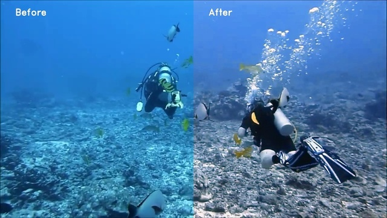

# Replication of WaterNet, IEEE TIP 2019

Modern replication of WaterNet in Pytorch from "An Underwater Image Enhancement Benchmark Dataset and Beyond", IEEE TIP 2019. 

[](https://colab.research.google.com/github/tnwei/waternet/blob/main/colab-example-waternet.ipynb)




_Source data: [A Surprise Diving Encounter with a Giant Humpback Whale, YouTube](https://www.youtube.com/watch?v=vAZkzV41sCc)_

## Usage in commandline

Git clone this repo, then do either `pip install -r requirements.txt` or `conda env create -f env.yaml`. Download weights from the training replication results section if needed.

Use `inference.py`: 

```bash
$ python inference.py --help
usage: inference.py [-h] [--source SOURCE] [--weights WEIGHTS] [--name NAME] [--show-split]

options:
-h, --help         show this help message and exit
--source SOURCE    Path to input image/video/directory, supports image formats: bmp, jpg, jpeg, png, gif, and video formats: mp4, mpeg, avi
--weights WEIGHTS  (Optional) Path to model weights, defaults to waternet_exported_state_dict-daa0ee.pt. Auto-downloads pretrained weights if not available.
--name NAME        (Optional) Subfolder name to save under `./output`.
--show-split       (Optional) Left/right of output is original/processed. Adds before/after watermark. 
```

Example:

```bash
$ python inference.py --source data/example/173.jpeg
Using device: cuda
No weights specified in --weights, using default: waternet_exported_state_dict-daa0ee.pt
Downloading: "https://www.dropbox.com/s/j8ida1d86hy5tm4/waternet_exported_state_dict-daa0ee.pt?dl=1" to /home/tnwei/projects/waternet/waternet_exported_state_dict-daa0ee.pt
Total images/videos: 1
Saved output to /home/tnwei/projects/waternet/output/40!  
```

## Usage in Python via torchhub

Load pretrained weights for your own usage via torchhub:

```python
import torch
import cv2

# Load from torchhub
preprocess, postprocess, model = torch.hub.load('tnwei/waternet', 'waternet')
model.eval();

# Load one image using OpenCV
im = cv2.imread("example.png")
rgb_im = cv2.cvtColor(im, cv2.COLOR_BGR2RGB)

# Inference -> return numpy array (1, 3, H, W)
rgb_ten, wb_ten, he_ten, gc_ten = preprocess(rgb_im)
out_ten = model(rgb_ten, wb_ten, he_ten, gc_ten)
out_im = postprocess(out_ten)
```

<!-- TODO: Training on higher res images -->

## Training

Git clone this repo, then do either `pip install -r requirements.txt` or `conda env create -f env.yaml`. 

Download the UIEB data raws and references from the [project website](https://li-chongyi.github.io/proj_benchmark.html). Unzip the RAR files, and place `raw-890` and `reference-890` in `data/`.

Use `train.py`:

```bash
$ python train.py --help
usage: train.py [-h] [--epochs EPOCHS] [--batch-size BATCH_SIZE] [--height HEIGHT] [--width WIDTH] [--weights WEIGHTS]

optional arguments:
  -h, --help            show this help message and exit
  --epochs EPOCHS       (Optional) Num epochs, defaults to 400
  --batch-size BATCH_SIZE
                        (Optional) Batch size, defaults to 16
  --height HEIGHT       (Optional) Image height, defaults to 112
  --width WIDTH         (Optional) Image width, defaults to 112
  --weights WEIGHTS     (Optional) Starting weights for training
  --seed SEED           (Optional) Seed to pass to `torch.random_seed()` for reproducibility, defaults to None i.e.
                        random
```

Example:

```bash
$ python train.py
Using device: cuda
Epoch 1/400: 100%|####################| 50/50 [01:11<00:00,  1.43s/it, loss=3.39e+3]
Validation: 100%|####################| 6/6 [00:05<00:00,  1.01it/s]
    Train || mse: 2.4e+03   ssim: 0.458   psnr: 15.2   perceptual_loss: 4.93e+04   loss: 4.86e+03
    Val   || mse: 1.24e+03   ssim: 0.592   psnr: 17.2   perceptual_loss: 6.98e+03

...
...

Epoch 400/400: 100%|####################| 50/50 [01:02<00:00,  1.25s/it, loss=873]
Validation: 100%|####################| 6/6 [00:05<00:00,  1.08it/s]
    Train || mse: 435   ssim: 0.919   psnr: 21.9   perceptual_loss: 8.54e+03   loss: 862
    Val   || mse: 446   ssim: 0.915   psnr: 21.7   perceptual_loss: 1.94e+03

Metrics and weights saved to /home/tnwei/projects/waternet/training/0
Total time: 28182.797650701832s
```

## Scoring

`score.py` was derived from `train.py` to evaluate trained network weights on the UIEB dataset.

## Paper summary

In [this paper](https://arxiv.org/abs/1901.05495), the authors constructed the Underwater Image Enhancement Benchmark dataset, which provides one-to-one pairings of original and reference underwater images. This was done by restoring underwater images via a multitude of SOTA methods, and have volunteers thoroughly vet and select the best ones as reference. he UIEB dataset can be downloaded from the [author's website](https://li-chongyi.github.io/proj_benchmark.html).

The UIEB dataset is subsequently used to train WaterNet, a fully convolutional network to perform image-to-image translation for reversing the effects of underwater light scattering. WaterNet is a gated fusion network that consists of two branches: input refinement and confidence map generation. First, transformed versions of the original input image are derived (namely, white balance correction, gamma correction and histogram equalization). 

- Input refinement: For each transformed image, a stack of conv layers generate refined inputs from the original image and the transformed image. 
- Confidence map generation: The original input image and the transformed images are forward propagated through a stack of conv layers to generate three confidence maps, one for each refined input from the previous branch.

WaterNet's final output image is a weighted sum of the refined inputs with the associated confidence maps. 

<!-- TODO: arch diagram below: -->

Source code for WaterNet is [shared on github](https://github.com/Li-Chongyi/Water-Net_Code), which is what this repo seeks to replicate. 

## Replication notes

The original repo uses MATLAB for generating transformed images, and Tensorflow 1 for the neural network itself.  

Here's what I've done in this repo:

- Reimplemented the network in Pytorch, converted the original pretrained weights.
- Replaced MATLAB image transforms in Python. The original repo later added image transforms in Python, but they are not equivalent to the original MATLAB implementation. Gamma correction and white balance correction logic are reimplemented as-is. Histogram equalization however relied on MATLAB's built-in `adapthisteq` function, and thus can't be reimplemented faithfully. Ended up using OpenCV's implementation of contrast-limited adaptive histogram equalization. Testing revealed that both implementations are close but not equivalent. 
- Training and inferencing CLI.
- Training replication (see below)

## Training replication results

Using dataset split with random seed 0 (replicated weights shared via Dropbox):

| Method | MSE  (x1e3) ↓ | PSNR (dB) ↑ | SSIM  ↑ |
| ------ | -------------- | ----------- | ------- |
| Original WaterNet weights, from paper | 0.7976 | 19.1130 | 0.7971
| Original WaterNet weights, scored in this repo | 0.6260 | 20.3766 | 0.8415 |
| Replicated WaterNet, 400 epochs / [link to weights](https://www.dropbox.com/s/0nzt1jowxavbkwa/replicated-waternet-20220528.pt?dl=0) | 0.4674 | 21.7300 | 0.9183 |
| **Replicated WaterNet, 400 epochs @ 256x256** / [link to weights](https://www.dropbox.com/s/g3ttnbjgi1pjp0v/replicated-waternet-256x256-20220529.pt?dl=0) | **0.4574** | **21.7964** | **0.9195** |
------------------

*Project based on the [cookiecutter-datascience-lite](https://github.com/tnwei/cookiecutter-datascience-lite/) template.*
